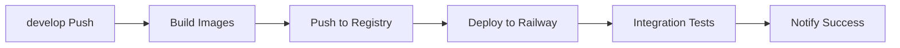
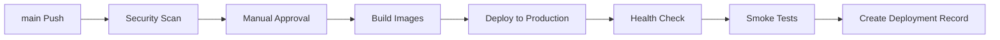
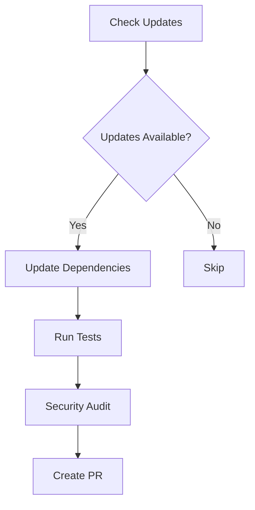

# 🔄 CI/CD パイプライン概要

Forex Prediction System の包括的な CI/CD パイプライン構成と運用ガイドです。

## 📊 パイプライン構成図

```
┌─────────────────────────────────────────────────────────────────┐
│                     CI/CD Pipeline Overview                     │
├─────────────────────────────────────────────────────────────────┤
│                                                                 │
│  ┌─────────┐    ┌─────────────┐    ┌──────────────┐             │
│  │   PR    │───▶│     CI      │───▶│  Integration │             │
│  │ Created │    │   Pipeline  │    │    Tests     │             │
│  └─────────┘    └─────────────┘    └──────────────┘             │
│       │                                    │                    │
│       ▼                                    ▼                    │
│  ┌─────────┐    ┌─────────────┐    ┌──────────────┐             │
│  │ develop │───▶│  Staging    │───▶│   Staging    │             │
│  │  merge  │    │   Deploy    │    │ Environment  │             │
│  └─────────┘    └─────────────┘    └──────────────┘             │
│       │                                    │                    │
│       ▼                                    ▼                    │
│  ┌─────────┐    ┌─────────────┐    ┌──────────────┐             │
│  │  main   │───▶│ Production  │───▶│ Production   │             │
│  │ merge   │    │   Deploy    │    │ Environment  │             │
│  └─────────┘    └─────────────┘    └──────────────┘             │
│                                                                 │
├─────────────────────────────────────────────────────────────────┤
│                    Scheduled Workflows                         │
│                                                                 │
│  ┌─────────────┐    ┌─────────────┐    ┌─────────────┐          │
│  │  Security   │    │ Dependency  │    │  Backup     │          │
│  │   Scan      │    │   Update    │    │  & Audit    │          │
│  │ (Mon 2AM)   │    │ (Mon 9AM)   │    │ (Daily 3AM) │          │
│  └─────────────┘    └─────────────┘    └─────────────┘          │
│                                                                 │
└─────────────────────────────────────────────────────────────────┘
```

## 🔄 ワークフロー詳細

### 1. CI Pipeline (`ci.yml`)

**トリガー**: Push/PR to `main`, `develop`

**ジョブ構成**:
```yaml
┌─── Backend Test ────┐  ┌─── Frontend Test ───┐  ┌─── Security ────┐
│ • Python 3.11       │  │ • Node.js 18        │  │ • Trivy scan     │
│ • pytest + coverage │  │ • ESLint            │  │ • Safety check   │
│ • flake8 + black    │  │ • TypeScript check  │  │ • npm audit      │
│ • mypy type check   │  │ • Prettier format   │  │ • CodeQL         │
└─────────────────────┘  └─────────────────────┘  └──────────────────┘
                                    │
                        ┌─── Docker Build ────┐
                        │ • Backend image     │
                        │ • Frontend image    │
                        │ • Multi-platform    │
                        └─────────────────────┘
```

**品質ゲート**:
- テストカバレッジ 80% 以上
- ESLint エラー 0件
- TypeScript エラー 0件
- セキュリティ脆弱性 HIGH/CRITICAL 0件

### 2. Staging Deploy (`deploy-staging.yml`)

**トリガー**: Push to `develop`

**フロー**:


**デプロイ先**: Railway Staging Environment
**URL**: `https://staging-forex-app.railway.app`

### 3. Production Deploy (`deploy-production.yml`)

**トリガー**: Push to `main` (要承認)

**フロー**:


**セキュリティ強化**:
- Pre-deployment security scan
- Manual approval required
- Zero-downtime deployment
- Automatic rollback on failure

### 4. Security Scan (`security-scan.yml`)

**トリガー**: Schedule (Mon 2AM) + Manual

**スキャンタイプ**:
- **Dependency**: Python/Node.js vulnerability check
- **Container**: Docker image security scan
- **Code**: Static analysis (CodeQL, Bandit, Semgrep)
- **Secrets**: Credential leak detection
- **Network**: OWASP ZAP scan (optional)

### 5. Dependency Update (`dependency-update.yml`)

**トリガー**: Schedule (Mon 9AM)

**更新フロー**:


### 6. Rollback (`rollback.yml`)

**トリガー**: Manual only

**安全性機能**:
- Target validation
- Approval requirement (emergency skip可)
- Current state backup
- Post-rollback verification

## 🔐 セキュリティとコンプライアンス

### Environment Protection

#### Production
- **必須承認者**: 1名以上
- **承認可能者**: Repository Admin/Maintainer
- **デプロイ制限**: `main` branch only
- **Secret分離**: Production専用secrets

#### Staging
- **自動デプロイ**: develop branch
- **承認**: 不要
- **Secret分離**: Staging専用secrets

### Secret管理
```
Repository Secrets (共通)
├── RAILWAY_TOKEN
├── ALPHA_VANTAGE_API_KEY
├── OANDA_API_TOKEN
└── OPENAI_API_KEY

Environment Secrets (環境別)
├── production/
│   ├── PRODUCTION_DATABASE_URL
│   ├── JWT_SECRET_KEY
│   └── PRODUCTION_API_KEY
└── staging/
    ├── STAGING_DATABASE_URL
    └── STAGING_API_KEY
```

## 📊 監視とメトリクス

### 自動収集メトリクス
- **Build time**: 各ジョブの実行時間
- **Test coverage**: バックエンド/フロントエンド
- **Security vulnerabilities**: 脆弱性数とレベル
- **Deployment frequency**: デプロイ頻度
- **Lead time**: コミット→本番までの時間

### アラート設定
- **Build失敗**: 即時Slack通知
- **Security脆弱性**: 高重要度で通知
- **Production Deploy**: 成功/失敗通知
- **Rollback実行**: 緊急アラート

## 🚀 運用ベストプラクティス

### ブランチ戦略
```
main (production)
├── hotfix/* (緊急修正)
└── develop (staging)
    ├── feature/* (機能開発)
    ├── bugfix/* (バグ修正)
    └── chore/* (メンテナンス)
```

### デプロイフロー
1. **Feature開発**: feature/* → develop
2. **Staging検証**: develop → staging environment
3. **本番リリース**: develop → main → production
4. **Hotfix**: hotfix/* → main → production

### コミットメッセージ規約
```
type(scope): subject

Types:
- feat: 新機能
- fix: バグ修正
- docs: ドキュメント
- style: コードスタイル
- refactor: リファクタリング
- test: テスト追加
- chore: その他

Examples:
feat(api): add currency pair prediction endpoint
fix(frontend): resolve chart rendering issue
docs(deploy): update deployment guide
```

## 🔧 トラブルシューティング

### よくある問題と解決策

#### 1. CI失敗
```bash
# ローカルでテスト実行
cd backend && pytest
cd frontend && npm test

# コード品質チェック
cd backend && black . --check && flake8 .
cd frontend && npm run lint && npm run type-check
```

#### 2. デプロイ失敗
```bash
# Railway CLI でログ確認
railway logs --service backend

# Docker build テスト
docker build -t test-backend ./backend
```

#### 3. Secret未設定
```bash
# Secret一覧確認
gh secret list
gh secret list --env production

# 必要なSecretの設定
gh secret set SECRET_NAME --body "value"
```

### 緊急時対応

#### Production 障害時
1. **即座にロールバック**:
   ```bash
   gh workflow run rollback.yml \
     -f environment=production \
     -f target_version=<last_stable_version> \
     -f reason="Production outage" \
     -f skip_confirmation=true
   ```

2. **根本原因調査**: ログ分析・メトリクス確認
3. **修正とテスト**: Staging環境で検証
4. **再デプロイ**: 修正版をProduction投入

#### CI/CD パイプライン障害時
1. **状況確認**: GitHub Actions status page
2. **代替手段**: 手動デプロイ準備
3. **復旧待機**: または手動介入

## 📈 改善とメンテナンス

### 定期レビュー項目
- [ ] **週次**: Failed build rate, Security scan results
- [ ] **月次**: Deployment frequency, Lead time metrics
- [ ] **四半期**: Pipeline効率化、新技術導入検討

### パフォーマンス最適化
- Build cache活用
- Parallel job実行
- Docker layer optimization
- Test並列実行

---

## 📚 関連ドキュメント

- [GitHub Secrets設定ガイド](./GITHUB_SECRETS_SETUP.md)
- [デプロイメントガイド](./DEPLOYMENT.md)
- [セキュリティガイド](./SECURITY.md)

## 🆘 サポート

CI/CDに関する問題は以下で報告してください:
- **Bug Report**: GitHub Issues with `ci/cd` label
- **Feature Request**: GitHub Discussions
- **緊急時**: Repository maintainers へ直接連絡